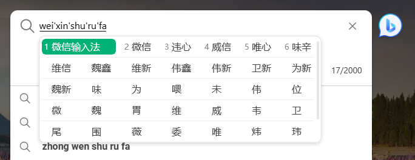
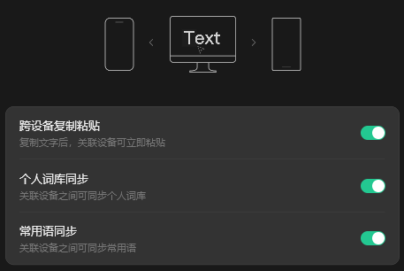
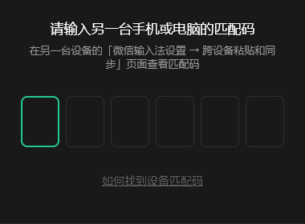

> 本文撰写于 2023 年 11 月 14 日，所提及的内容可能有所变动。

# 简洁

微信输入法没有多余的功能，足够简洁：像国内其他输入法的皮肤、账号等功能，微信输入法都没有提供。*（也有可能是还没做好）*

但简洁同时也带来了一些缺点：你暂时没法随心所欲地自定义微信输入法的外观，也没有办法云端同步你的输入法设置和词库。

期待微信输入法将来的更新能够带来云端同步的功能。

# 好用

微信输入法采用了多行的候选，按下翻页键，多行候选词便展现出来，能够更快的找到自己的候选词，但用惯了切换而不是展开候选词的用户可能要花一些时间适应一下。

同时，微信输入法提供了跨设备功能，支持跨设备复制粘贴和个人词库、常用语同步，间接弥补了缺失云端同步的缺点。

当前版本，跨设备功能的关联设备步骤十分简单，只需要输入另一个设备的匹配码即可绑定。

 

# 总结

总而言之，微信输入法是一个足够简洁、好用的输入法，对于用惯了国内臃肿的输入法的用户来说值得一试。

但现在的版本还不支持 U 模式输入，此功能的重度用户还暂时不建议切换微信输入法使用。

下载方式：[通过微信输入法官网下载](https://z.weixin.qq.com/)